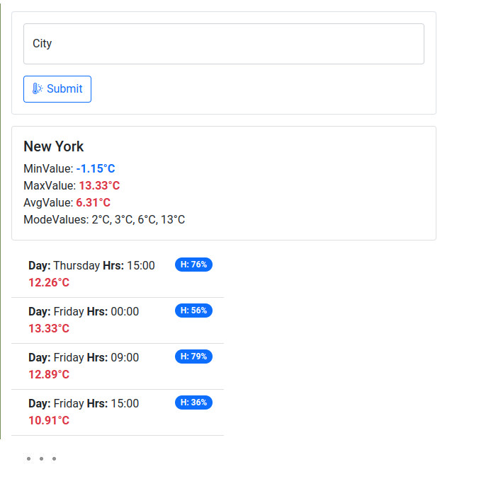

# Simple forecast app

## Description

Using Javascript and any frameworks/libraries you’d like, make use of free API, then format and
display the resulting data on a page.

* The page should show 5-day weather forecast for given city including
  - [x] Morning temperature
  - [x] Day temperature
  - [x] Night temperature
  - [x] Humidity
* The page should also show following stats relevant to weather forecast
  - [x] Minimum value
  - [x] Maximum value
  - [x] Mean value
  - [x] Mode value

### Done

All elements from the list above are done

### TODO

For the time being, due to the lack of time for developing, the following actions have to be performed

* clear the code
* error handling
* form validation
* improve UX
* rewrite code to TS?

## Current state of the GUI

## Getting Started

Get your free API key from [openweathermap.org](https://openweathermap.org/forecast5). Fill in the .env file with your API key.

```
REACT_APP_API_KEY={your-api-key}
REACT_APP_API_URL=https://api.openweathermap.org/data/2.5/forecast
```

Install dependiences. In the project directory, you should run:
### `npm install`

Then, in the project directory, you can run:

### `npm start`

Runs the app in the development mode.\
Open [http://localhost:3000](http://localhost:3000) to view it in your browser.

### `npm run build`

Builds the app for production to the `build` folder.\
It correctly bundles React in production mode and optimizes the build for the best performance.

The build is minified and the filenames include the hashes.\
Your app is ready to be deployed!

## Learn More

You can learn more in the [Create React App documentation](https://facebook.github.io/create-react-app/docs/getting-started).

To learn React, check out the [React documentation](https://reactjs.org/).